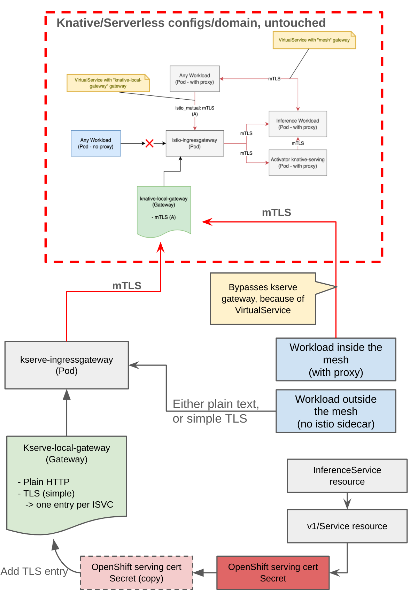
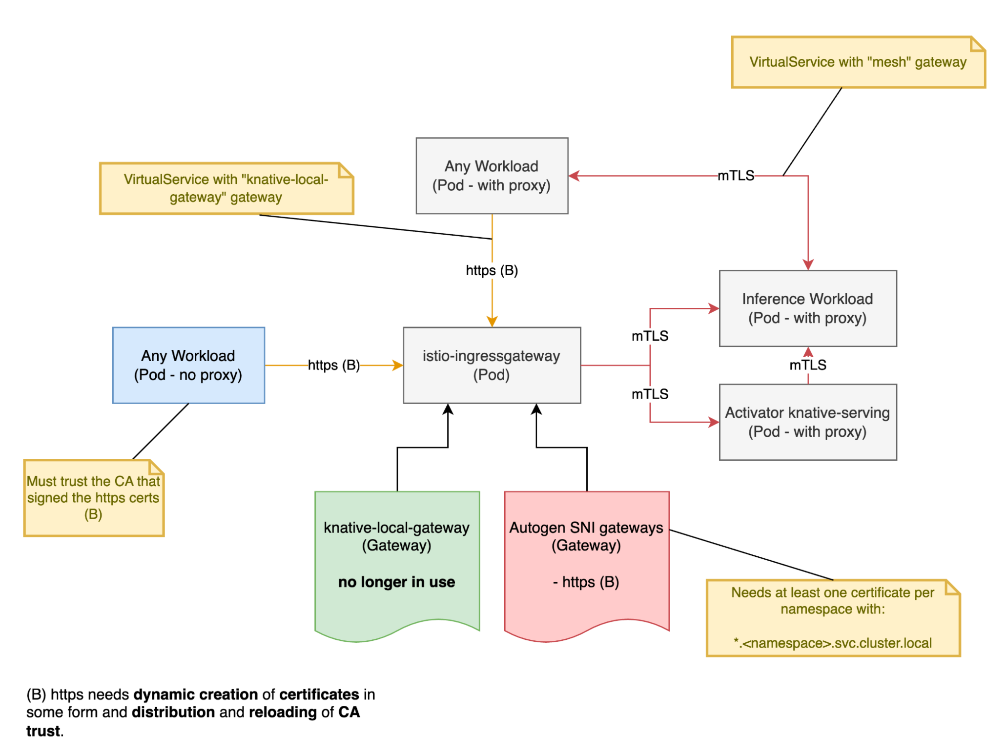

# Open Data Hub - KServe Enable Private Endpoint 

|                |                                                                  |
| -------------- | ---------------------------------------------------------------- |
| Date           | May 5, 2024                                                      |
| Scope          | Model Serving(KServe Serverless mode)                            |
| Status         | Review                                                           |
| Authors        | [Jooho Lee](@JOOHO)                                              |
| Supersedes     | N/A                                                              |
| Superseded by: | N/A                                                              |
| Tickets        | [Tracking Issue](https://issues.redhat.com/browse/RHOAIENG-7918) |
| Other docs:    | none                                                             |

## What
This ADR addresses the issue with Kserve Serverless using Istio and mTLS, which requires client certificates between pods. Applications accessing the isvc endpoint via service hostname in the same cluster must include an Istio sidecar, or they will fail.

## Why
Customers deploying ODH/RHOAI on OpenShift Cluster do not expect to include their services in the mesh to access deployed models. From their perspective, models deployed through KServe are just another service, and changing the network layer for access is burdensome. Therefore, we need to provide an out-of-the-box solution allowing access to inference services via internal hostnames, similar to other services.

## Goals
- Pods without an Istio sidecar should have access to the isvc endpoint.
- Ensure a seamless transition for users from ModelMesh to KServe.
- Implement a stable and tested solution.

## Non-Goals
- Immediate overhaul of the existing Knative infrastructure.
- Long-term commitment to a specific certificate management solution.

## How
It involves adding an Ingress Gateway and integrating with OpenShift Certificates services.
The new Istio ingress gateway would only be used for internal requests.
- KServe would no longer share the knative-local-gateway, with regards to configurations.
- The new Istio ingress gateway would forward requests to knative-local-gateway
- i.e. we build on top of Knative routing needs (or we chain KServe routing needs with Knative ones)
- The ISTIO_MUTUAL configuration on knative-local-gateway is no longer an issue.
- Since both KServe and Knative gateways belong to the mesh, they can use mTLS.
- KServe gateway would be capable of a TLS-simple configuration.

  

## Open Questions
Does UI need to add a URL for private?
Does Serverless/ServiceMesh team support the proposed way?
Can ServiceMesh team make the solution more efficient? 

## Alternatives
Knative team members designed the solution below for consideration. The benefit of the solution being in Knative layer is sharing tests coverage within the component and have lighter the ODH/KServe layer on top of it. This alternative solution is not available in Knative yet and it requires a new component `cert-manager`. Therefore, it may take a time to be done, so it can be considerable in the future once available. In contrast, the main solution proposed in this document is for the short term in ODH releases.

  

## Security and Privacy Considerations
- Ensuring that the chosen solution maintains or enhances the current security posture.
- Managing the secure transition and implementation of certificate management.

## Risks
- Delays in implementation affecting user migration.
- Limited testing of this method possibly leads to unforeseen issues.

## Stakeholder Impacts

| Group        | Key Contacts                                                                                                                                    | Date        | Impacted? |
| ------------ | ----------------------------------------------------------------------------------------------------------------------------------------------- | ----------- | --------- |
| ModelServing | [Jooho Lee](jlee@redhat.com), [Edgar Hernandez](ehernand@redhat.com), [Alessandro Lazarotti](lazarotti@redhat.com)                              | May 5, 2024 | Yes       |
| Serverless   | [Reto Lehmann](rlehmann@redhat.com), [Lukas Berk](lberk@redhat.com), [Stavros Kontopoulos](skontopo@redhat.com), [Roland Huß](rhuss@redhat.com) | May 5, 2024 | Yes       |
| ServiceMesh  | [Rob Cernich](rcernich@redhat.com), [Bartosz Majsak](bmajsak@redhat.com), [Aslak Knutsen](aknutsen@redhat.com)                                  | May 5, 2024 | Yes       |
| Dashboard    | [Andrew Ballantyne](aballant@redhat.com), [Lucas Fernadez aragon](lferrnan@redhat.com), [Vince Conzola](vconzola@redhat.com)                    | May 5, 2024 | Yes       |
| ODH Operator | [Vaishnavi Hire](vhire@redhat.com)                                                                                                              | May 5, 2024 | Yes       |

# Reviews

| Reviewed by           | Date        | Approval | Notes |
| --------------------- | ----------- | -------- | ----- |
| Jooho Lee             | Jun 3, 2024 | Approved |       |
| Edgar Hernandez       | Jun 3, 2024 | Approved |       |
| Alessandro Lazarotti  | Jun 3, 2024 | Approved |       |
| Daniele Zonca         | Jun 3, 2024 | Approved |       |
| Reto Lehmann          | Jun 3, 2024 | Approved |       |
| Rob Cernich           |             |          |       |
| Lucas Fernadez aragon |             |          |       |
| Vaishnavi Hire        |             |          |       |
| Wen Zhou              |             |          |       |
